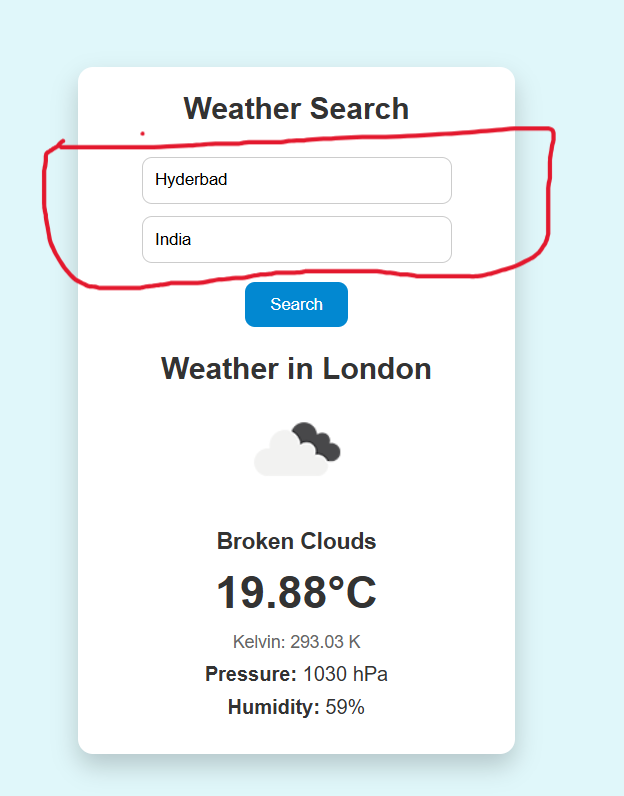
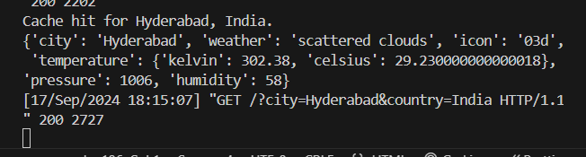
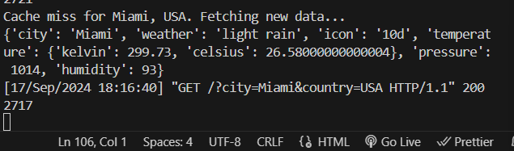
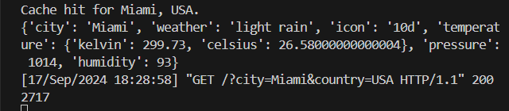

# Project Details (Or just a 'How to use this API?')

### Key steps: 

1. Open `https://openweathermap.org/api` in your browser
2. Create your account and look for your `API key`
3. Go to `API` tab > Look for current weather data collection in the page > Click on API `DOC` of `current weather data` > Look for the API call link for cities.
`https://api.openweathermap.org/data/2.5/weather?q={city},{country}&APPID={api_key}`
    - You'll find the above link. 
4. In views `import request` and in a view make var `url` and assign the url.
5. get the url's json using requests library's get function and assign them in a variable.
6. make a `payload` dict object with:
    - city
    - weather
    - icon
    - temperature (convert from kelvin to celcius)
    - pressure
    - humidity
7. Make context dictionary and pass the `payload`.
8. The contents of that url will be displayed onto the command prompt due to the requests library when runserver is used. 
9. The weather app's data is ready to be used and accessed in the templates.

Additionals: 
- Show both celcius and kelvin. Since we get the temperature in kelvin we can make it celcius using `kelvins - 273`
- Take the input city and country from user to get their desired temperature. 
- Implemented a search funtionality, however the number of searches it takes that many number of API calls takes place. 
    - Problem? The problem with this is even if someone enters a city twice or multiple times, for that same city it would count all it's API calls. 
    - Solution: The solution is to Cache API results (redis or django's in-built cache system). 

    How it works (my implementation using Django in-built cache):
    - Caching the result: The weather data for a specific city and country is stored in the cache for 1 hour (timeout=3600). You can adjust the timeout as needed.
    - Retrieving cached data: If the user searches for the same city and country within that time period, the cached data is used, preventing an API call.
    - Cache hit: When the data is retrieved from the cache, it will log "Cache hit for {city}, {country}." to the console.
    - Cache miss: If the cache does not contain the data, it will log "Cache miss for {city}, {country}. Fetching new data...", indicating that a new API request is being made.

### Here's the demo for caching the results
[Note: The webpage images are quite different in this demo, the actual UI is kinda vibrant and lean towards dark theme.]

- The images of the **webpage** are for displaying the **search query**
- **CLI (Command Line Interface)** images are to see if the it's **cache hit or miss**.

Searching for `Hyderabad, India` to see if it's searched previously (is `hyd` cache hit?). Which is true because I searched it once. [Note: search is not clicked, ignore that London results it's from previous search]

On searching it it gives cache hit as expected:

Let's see for `Miami, USA`:
.png)
Here when I searched for `Miami, USA` it gave the results as show above.
However here's what CLI says:

There wasn't any search for `Miami, USA` previously done by the user so it gave `cache miss`

Now if I search for miami again, here's what CLI says:

Bravo! A cache hit on research. 

*Caching the API results is a good technique when you need to reduce the API calls, here we used Django's in-built caching system.*

